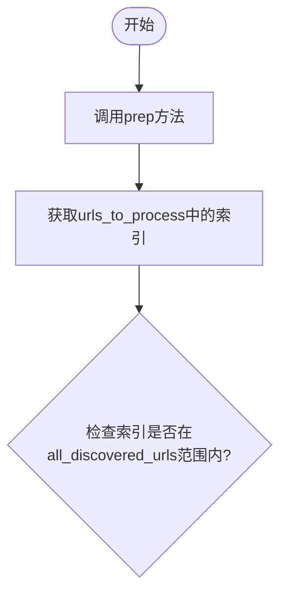

# 有向图 -- 流程

## 数据流内容--共享数据（shared）的核心键含义
* urls_to_process：待爬取的 URL 索引列表;
* all_discovered_urls：所有已发现的 URL 的完整列表（按发现顺序存储）;
* url_content：字典，键为 URL 索引，值为对应 URL 的（截断后）文本内容;
* visited_urls：集合，存储已成功爬取的 URL 索引;
* url_graph：字典，键为 URL 索引，值为该 URL 页面中发现的其他 URL 的索引列表（构建链接关系）;
* allowed_domains：允许爬取的域名列表（用于过滤链接）;
* progress_queue：用于传递爬取进度信息的队列（如向 UI 发送更新）

